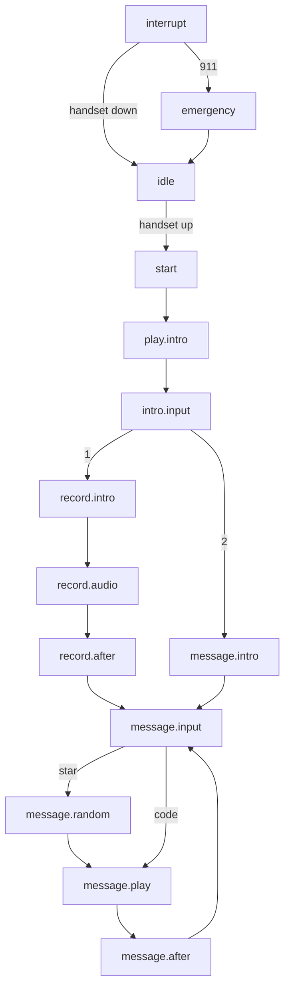

```mermaid
flowchart TD
    idle -->|handset up| start
    interrupt --> |handset down| idle
    interrupt --> |911| emergency --> idle
    start --> play.intro
    play.intro --> intro.input
    intro.input -->|1| record.intro
    intro.input -->|2| message.intro
    record.intro --> record.audio
    record.audio -->  record.after
    record.after --> message.input
    message.intro --> message.input
    message.input -->|star| message.random
    message.random --> message.play
    message.input -->|code| message.play
    message.play --> message.after
    message.after --> message.input
```

  
